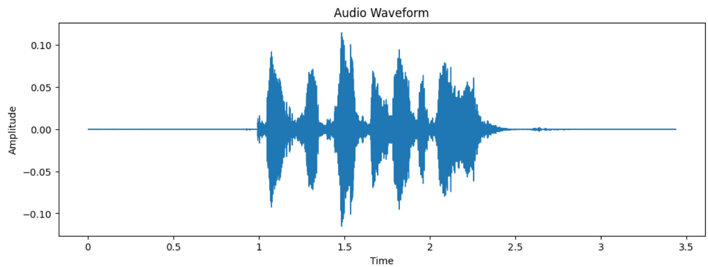
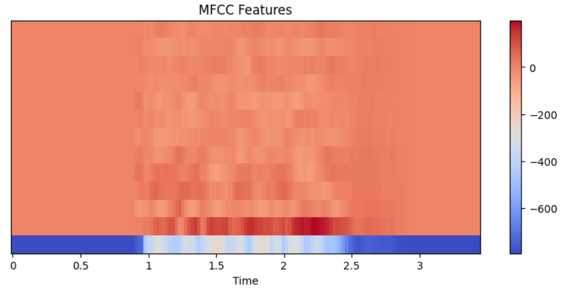

Speech Emotion Recognition using Machine Learning

Project Overview

This project implements a Speech Emotion Recognition System that identifies human emotions from audio recordings using Machine Learning.
The system processes audio files, extracts acoustic features using MFCC (Mel Frequency Cepstral Coefficients) and classifies the speaker's emotional state using Random Forest Classifier

Problem Statement

Human emotions plays a crucial role in communication. Recognizing emotions automatically from speech can be useful in various fields like:

Human-Computer Vision

Virtual Assistants

Customer Service Analytics

Mental Health Monitoring

Emotion Aware AI Systems

The objective of this project is to predict the expressed emotions in a speech recording.

Dataset

RAVDESS Dataset

The project uses audio samples from the RAVDESS (Ryerson Audio-Visual Database of Emotional Speech and Song) dataset.
Each audio filename contains metadata describing the recording.

Example:

03-01-05-01-01-01-01.wav

The third field represents the emotion code.

Emotion Mapping

Code	Emotion

01	    Neutral

02      Calm

03	    Happy

04	    Sad

05	    Angry

06	    Fearful

07	    Disgust

08	    Surprised

Project Workflow

1. Dataset Loading: 

Load all WAV audio files
Extract emotion labels from filenames

2. Audio Processing:

Read audio signals using Librosa
Obtain waveform and sampling rate

3. Feature Extraction:

MFCC features are extracted from each audio file.

For every recording:

13 MFCC Mean Features
13 MFCC Standard Deviation Features

Total Features Per Sample:

26 Features

4. Dataset Preparation

Feature Matrix:

X = Audio Features

Label Vector:

Y = Emotion Labels

5. Train-Test Split

Dataset split:

Training Set = 80%
Testing Set = 20%

6. Model Training

Model Used:

Random Forest Classifier

7. Model Evaluation

Evaluation Metrics:

Accuracy
Precision
Recall
F1 Score
Confusion Matrix
Cross Validation

8. Emotion Prediction

The trained model predicts the emotion of unseen audio recordings.

Technologies Used

Python
NumPy
Pandas
Matplotlib
Librosa
Scikit-Learn
Joblib
Google Colab

MFCC (Mel-Frequency Cepstral Coefficients)

MFCCs are widely used in speech and audio processing because they capture important characteristics of human speech.

For each audio file:

Audio Signal
MFCC Extraction
Mean Calculation
Standard Deviation Calculation
Feature Vector Creation

Final Feature Vector:

26 Dimensions

Model Selection

Several Random Forest configurations were tested using Cross Validation.

Number of Trees	    Cross Validation Accuracy

    10	                        48.3%

    50	                        65.0%
    
    100	                        65.0%
    
    200	                        68.3%
    
    500	                        63.3%

Best Configuration:

n_estimators = 200

Results

Cross Validation Accuracy

68.3%

Hold-Out Test Accuracy

50%

The difference between Cross Validation Accuracy and Test Accuracy is expected because the project currently uses a small subset of the dataset.

Sample Prediction

Input: Speech Audio File

Output: Predicted Emotion

Example:

Actual Emotion: Surprised

Predicted Emotion: Happy

Visualizations

The project includes:

Audio Waveform Visualization

MFCC Feature Heatmap

Repository Structure

speech-emotion-recognition/

├── Speech_emotion_recognition.ipynb

├── emotion_model.pkl

├── README.md

├── requirements.txt

├── .gitignore

└── sample_results/

├── waveform.png

├── MFCC.png

How to Run

1. Clone Repository

git clone

2. Install Dependencies

pip install -r requirements.txt

3. Open Notebook

Speech_emotion_recognition.ipynb

4. Run All Cells

5. Train Model and Predict Emotions

Limitations
Uses a small subset of the RAVDESS dataset (60 samples).

Performance is limited by dataset size.

Only MFCC-based features are used.

Deep Learning models were not explored in this implementation.

Future Improvements

Use the complete RAVDESS dataset.

Add Chroma Features.

Add Mel Spectrogram Features.

Implement CNN-based Deep Learning Models.

Build a Web Application Interface.

Enable Real-Time Emotion Recognition.

Learning Outcomes

Through this project, I gained hands-on experience with:

Audio Signal Processing

Feature Extraction using Librosa

MFCC Feature Engineering

Machine Learning Classification

Model Evaluation

Cross Validation

Confusion Matrix Analysis

Model Saving and Loading

End-to-End ML Pipeline Development

Author

Sakshi Choudhary

BSc(Hons)
